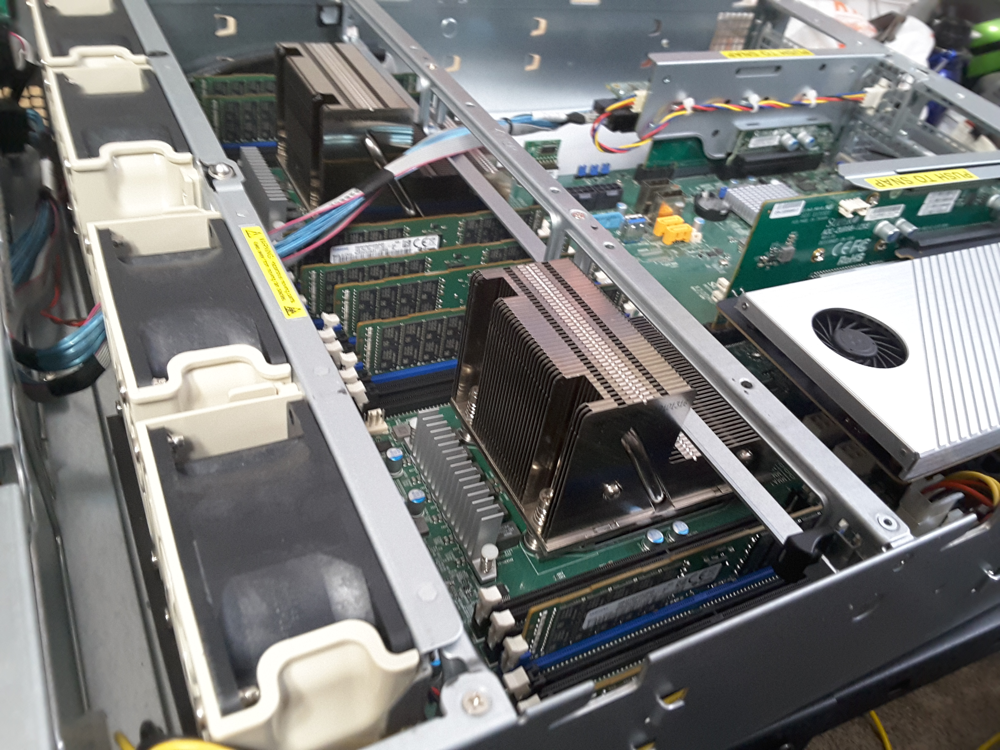
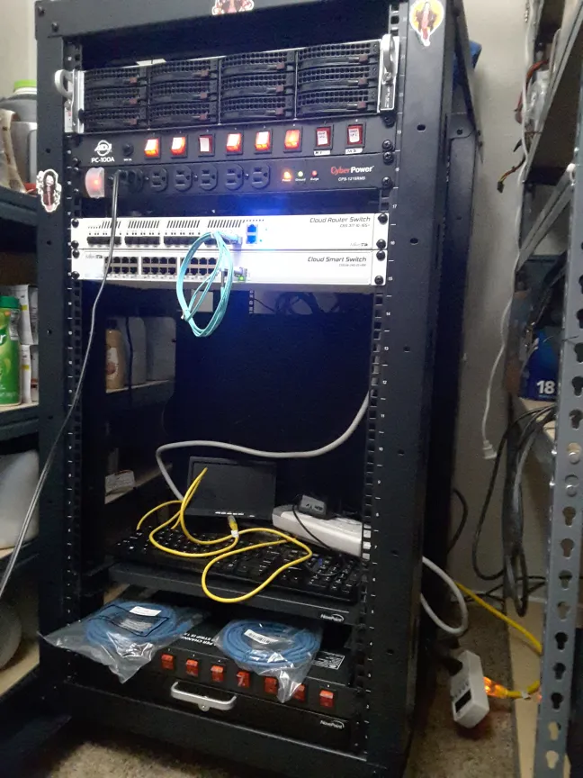
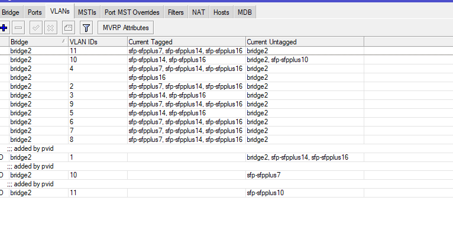
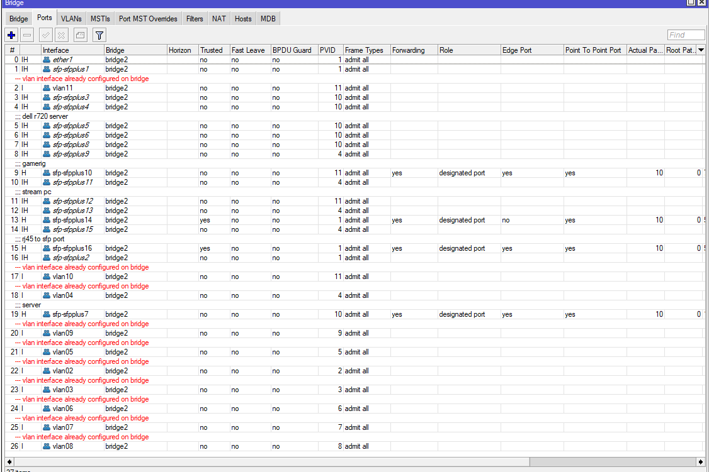
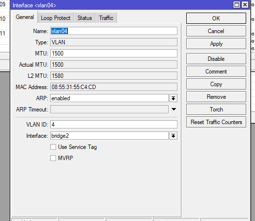
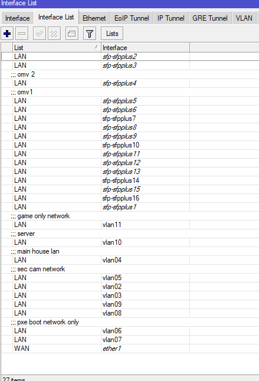
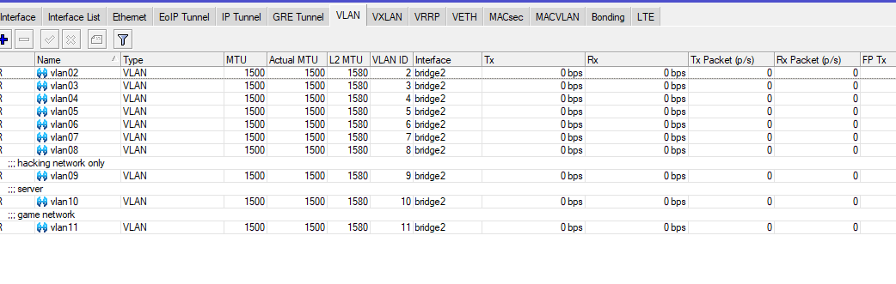

# new-lab

## made in 2023 updated 2025

I had a good run of luck. One of my friends offered me two small servers, then other people started offering things, so I got a very nice lab built for almost nothing. I started with a 12-bay SuperMicro. I decided to get some SSDs, some m.2, and some normal 3.5's (as this is a 2u Super Micro). I ran this for about 1.5 years. It was given OMV bare metal on an SSD. I ran into the same issue i had with the other server where it would just randomly crash when doing anything with nessus, cloud things or kasm when this happen it would break docker totally, while i never fully figured this out i will assume it is a omv specfic issue so after round about the 20th format I got tired of fixng it and decide to go another route.

## Starting mikrotik

Starting a network:  seeing how I had the large server, I got a rack and decided to get some networking gear, but what? I decided to go with Supermicro. The network gear I went with is Supermicro and MikroTik, mostly for price but also due to the fact that I could use SFP+. This allowed me to use DAC or fiber. I went with fiber because the price at the time was cheaper, and 10 Gbps was the only thing a home user could get without some crazy connection or price. After getting all the gear, I realized at the last minute that the network would need wifi as well as a router. I did not take this into consideration. The one they would give us was cat-only, at least on the user side. This was a problem, so I did a fast order and grabbed up a Dell R720 and made this a hardware-only firewall. Mostly just for the fact that it was very cheap and I could put in some fiber cards.

I was not only new to Mikrotik, but I was also new to OPNsense, the firewall I had chosen to go with. I played around with around 10 or 11 of them. However, the more user-friendly OpenSense, I decided to go with this.

  

