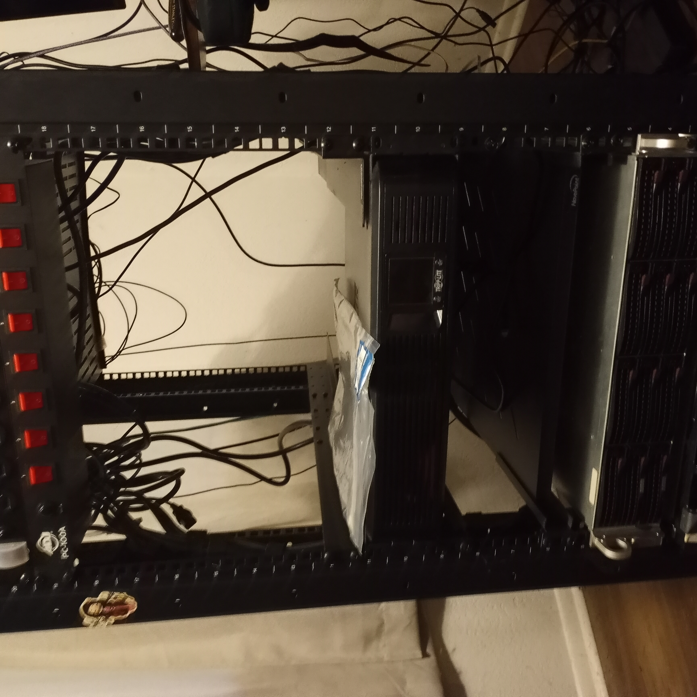
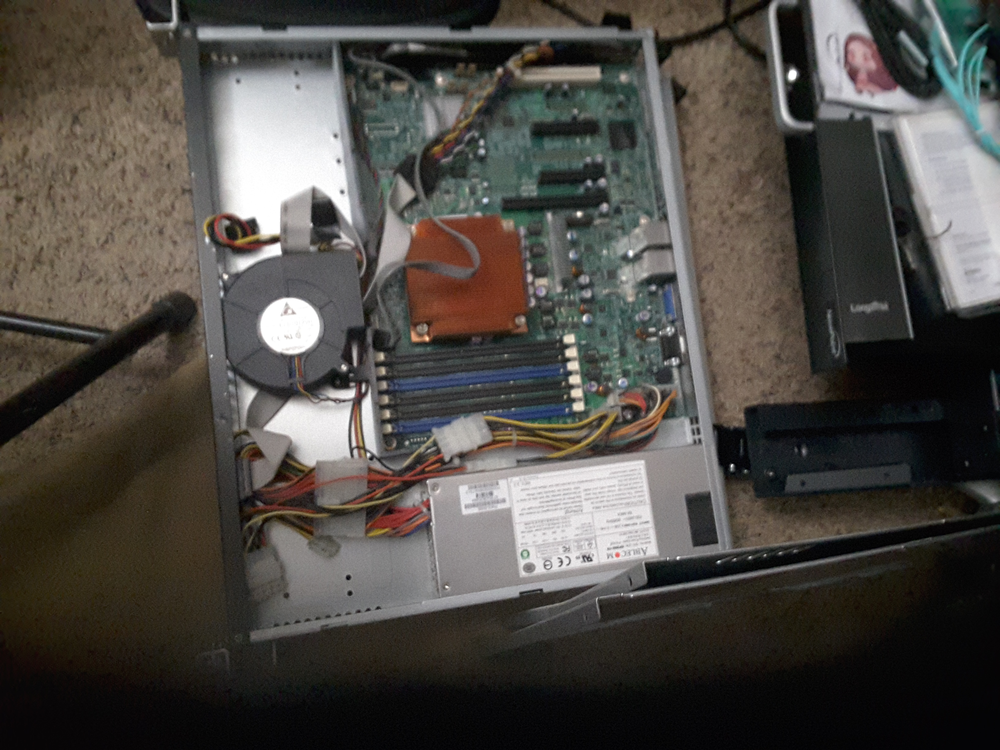
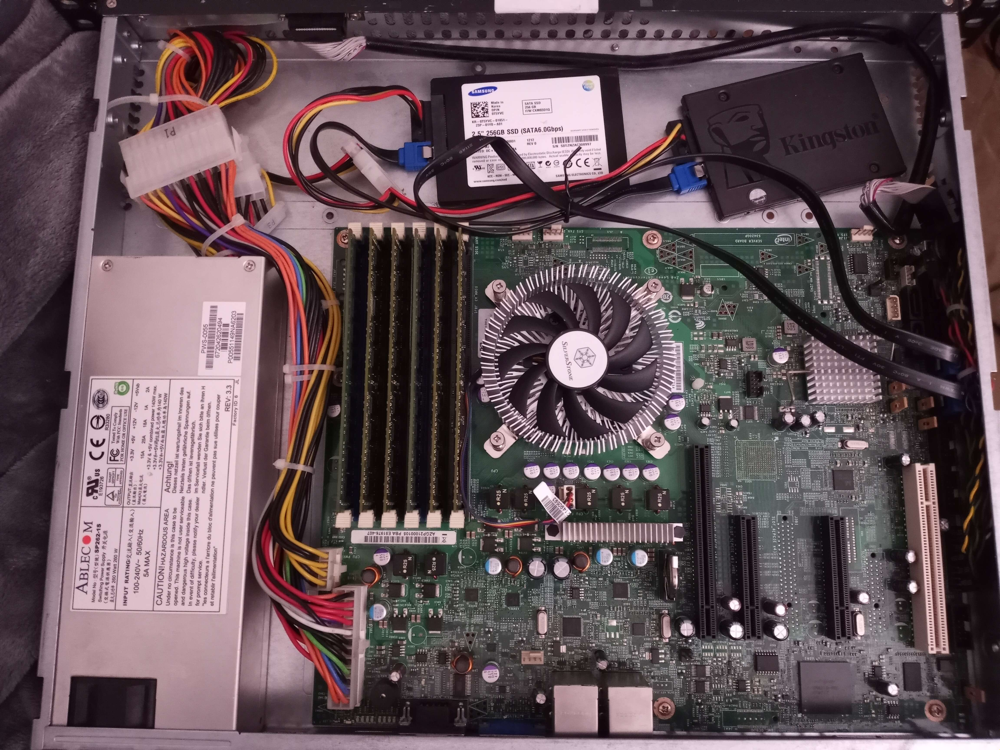
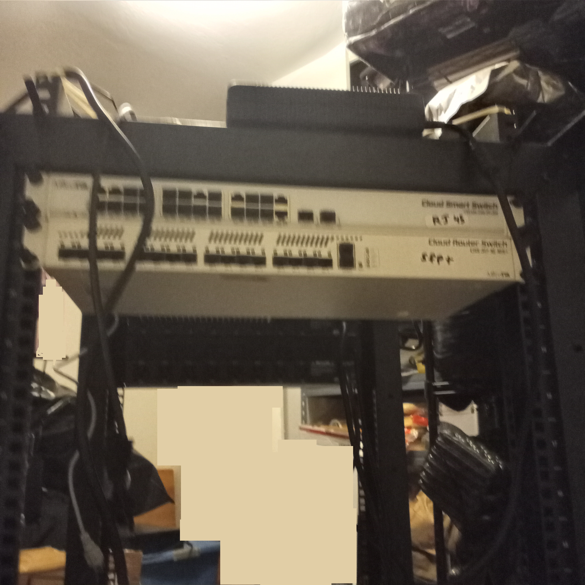
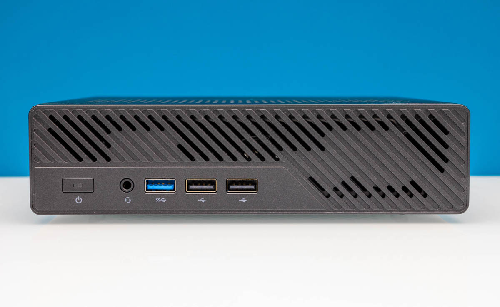
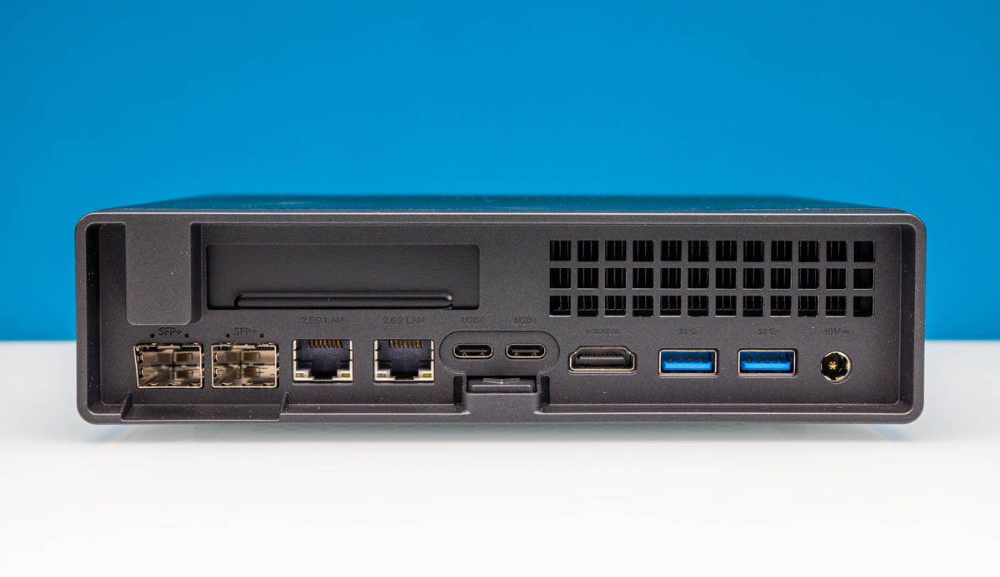
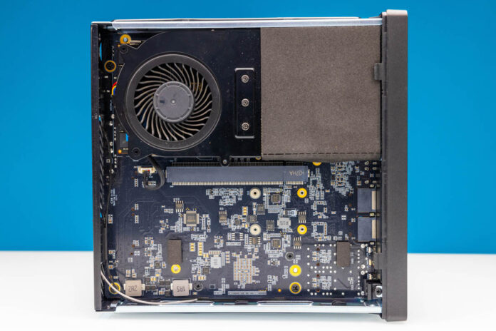
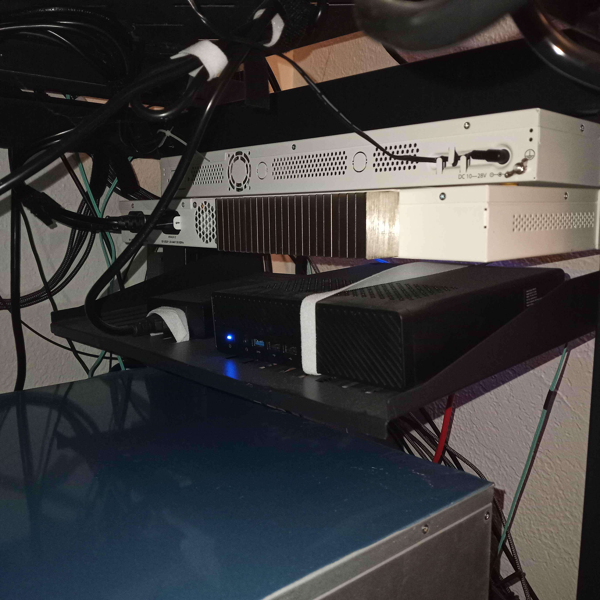
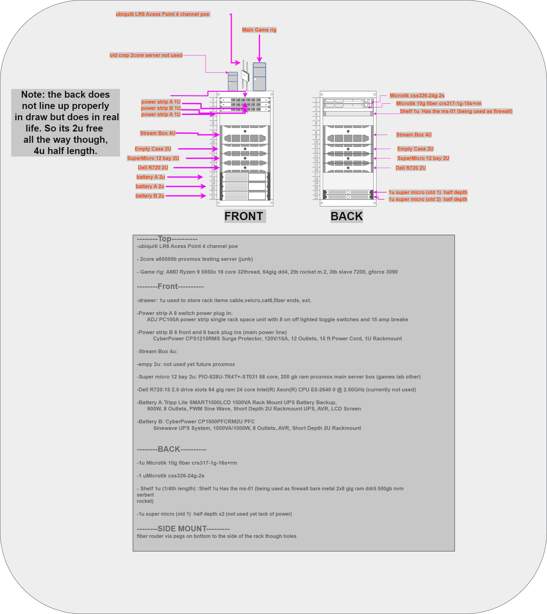
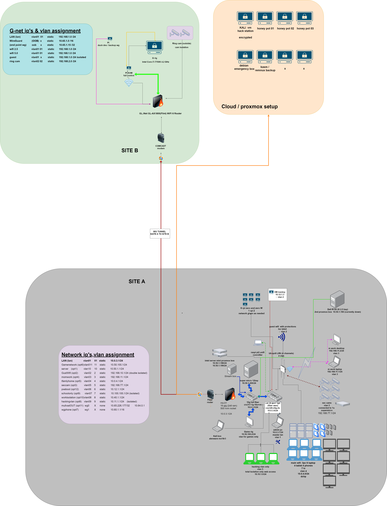

# new-lab

## made in 2023 updated 2025

I had a good run of luck. One of my friends offered me two small servers, then other people started offering things, so I got a very nice lab built for almost nothing. I started with a 12-bay SuperMicro. I decided to get some SSDs, some m.2, and some normal 3.5's (as this is a 2u Super Micro). I ran this for about 1.5 years. It was given OMV bare metal on an SSD. I ran into the same issue i had with the other server where it would just randomly crash when doing anything with nessus, cloud things or kasm when this happen it would break docker totally, while i never fully figured this out i will assume it is a omv specfic issue so after round about the 20th format I got tired of fixng it and decide to go another route.

main supermicro 

early setup of rack>
try one:

try two:

## Starting mikrotik

Starting a network:  seeing how I had the large server, I got a rack and decided to get some networking gear, but what? I decided to go with Supermicro. The network gear I went with is Supermicro and MikroTik, mostly for price but also due to the fact that I could use SFP+. This allowed me to use DAC or fiber. I went with fiber because the price at the time was cheaper, and 10 Gbps was the only thing a home user could get without some crazy connection or price. After getting all the gear, I realized at the last minute that the network would need wifi as well as a router. I did not take this into consideration. The one they would give us was cat-only, at least on the user side. This was a problem, so I did a fast order and grabbed up a Dell R720 and made this a hardware-only firewall. Mostly just for the fact that it was very cheap and I could put in some fiber cards.

I was not only new to Mikrotik, but I was also new to OPNsense, the firewall I had chosen to go with. I played around with around 10 or 11 of them. However, the more user-friendly OpenSense, I decided to go with this.

  

After a short time of learning curve area, I got the hardware down. Now I have my R720 and my setup. While this took a lot of power, it ran GREAT for two or so years.

I then decided to downgrade the power and upgrade the offline electric: I did this by getting two new batteries, and the old one only did 7 minutes for the full lab, enough to shut down but not run, so it bypassed our little 1-30 second offlines in the wintertime. So now I have three total batteries, 1 of 1 brand and 2 of another. The others are much, much better. My  main actual network, that's both  switch the level 2 and the level 3 are on one battery, one of the actual server "main server" is on the other, and the extra server (the old Dell R720) is on number three 

## Main firewall setup part2 (ms-01)

Game setup for amp:

Working automated bans redirects and ddos prevention

Forcing a guest out over a VLAN while using a VPN exit node.

# Mini pc x2

Fan Modification

## Had a idea to conserve space

final setup:
from top to bottom:
I decided to place networking at the rear top, opposite the power.

 

below on the shelf is the ms-01 the replacement for the dell firewall:

1/4th shelf  that holds both the power brick and the ms-01: (for now)

On the front:

side project for the modem (fiber)

final cleanup 
before:

after:

and at the very top we have the junk top:

and the game rig:

current rack overview:

The current network topology is described in words.

visualzation of network setup:

# General speed test on 10/100/1000 networking card:

This concludes the physical setup. I’ll refer back to it when assigning VLAN IDs or discussing Proxmox in the future.